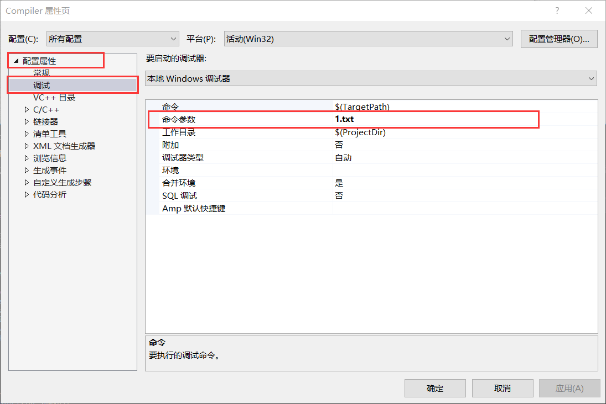

# Compiler

### 0、先初始化表，然后再分析程序

* 先使用 `--init` 参数运行一次程序，根据文法产生表（Action表和Goto表）

* 再将要分析的程序文件名作为参数运行一次程序，即可获得文件 `analyze.xp` 分析过程和结果

* 以后如果不更改文法，分析其他程序时，跳过第一步直接进行第二步，可以获得性能提升

### 1、vs中添加参数调试方法

* 点击菜单栏中 `调试` ->  最下方的当前项目的 `属性`

* 按照下图输入参数（此项目中为文件名）

* 将所对应的文件放入项目的 `.vcxproj` 文件所在的目录里

  

### 2、g++编译方法

* 输入命令 `g++ -finput-charset=gbk --std=c++11 main.cpp -o reposc` 可以编译成可执行文件reposc

* 将所对应的文件和编译出的可执行文件放在一起，并带参数运行：
  `./reposc 1.txt`
